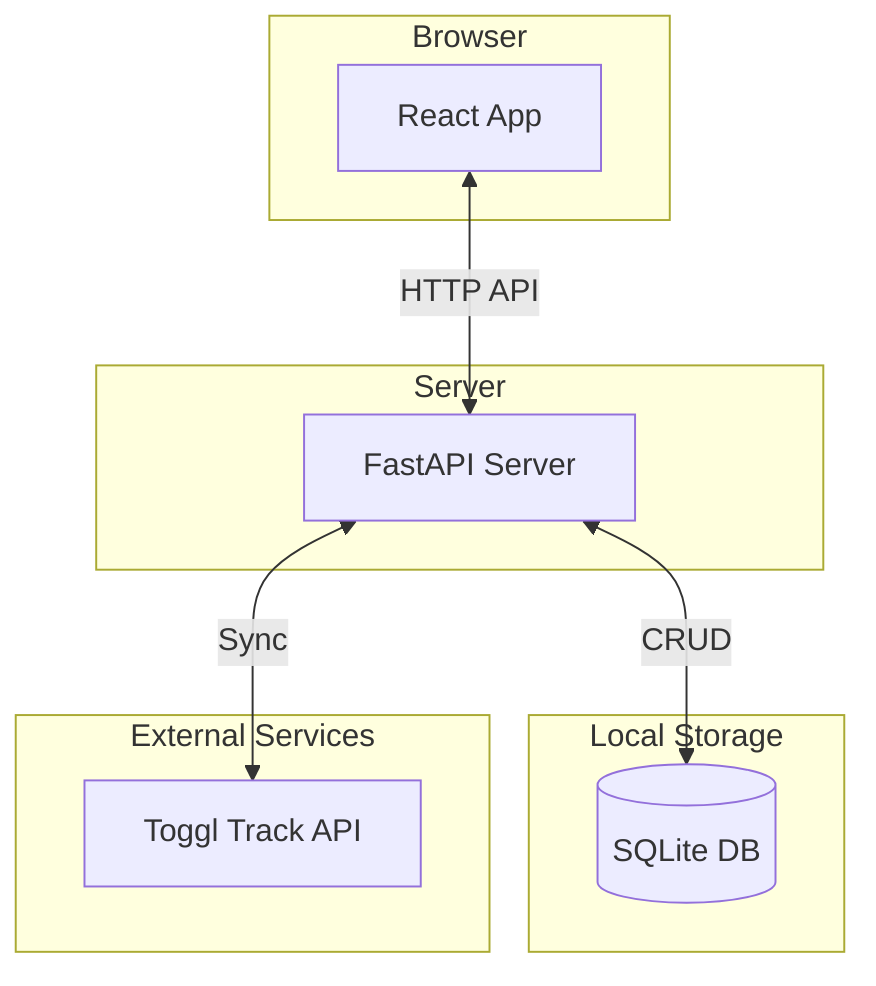

# Sync Toggl Track Events

This is a full-stack application for syncing [Toggl Track](https://toggl.com/track/) time entries to a local database. It provides a web interface to view, filter, and annotate your time entries with personal notes.

The main motivation is to have a private, enhanced view of your Toggl data, allowing for more detailed annotations than Toggl's native tags provide.

## Features

- **Backend**:
    - Built with [FastAPI](https://fastapi.tiangolo.com/).
    - Syncs Toggl time entries into a local [SQLite](https://www.sqlite.org/index.html) database.
    - Provides a REST API for the frontend to consume.
    - Uses `polars` and `connectorx` for efficient data handling.

- **Frontend**:
    - Built with [React](https://reactjs.org/), [Vite](https://vitejs.dev/), and [TypeScript](https://www.typescriptlang.org/).
    - UI components from the [Mantine](https://mantine.dev/) library.
    - Uses [TanStack React Query](https://tanstack.com/query/latest) for data fetching, caching, and optimistic UI updates.
    - Daily view of time entries with navigation.
    - Add and delete notes on individual time entries.
    - Filter entries by project.
    - Displays the currently running Toggl timer with a live-updating duration.

## Architecture

The project is a classic client-server application.



## Setup and Running

### Prerequisites

-   [Python 3.12+](https://www.python.org/)
-   [`uv`](https://astral.sh/uv/) (Python package/dependency manager)

    The recommended way to install `uv` is via the official standalone installer script (not via pip):
    
    ```sh
    curl -LsSf https://astral.sh/uv/install.sh | sh
    ```
    
    For more details and alternative installation methods (including Windows), see the [official uv installation documentation](https://docs.astral.sh/uv/getting-started/installation/#installation-methods).

-   [Node.js and pnpm](https://pnpm.io/installation)

### 1. Backend Setup

The backend server is responsible for syncing data from Toggl and providing it to the frontend.

1.  **Navigate to the backend directory:**
    ```bash
    cd backend
    ```

2.  **Set up environment variables:**
    Create a `.env` file by copying the example:
    ```bash
    cp .env.example .env
    ```
    Now, edit `.env` and fill in your details:
    -   `TOGGL_TOKEN`: Your Toggl API token, found on your [profile page](https://track.toggl.com/profile).
    -   `WORKSPACE_ID`: Find this in the URL of your Toggl workspace (e.g., `https://track.toggl.com/reports/summary/<WORKSPACE_ID>`).

3.  **Install Python dependencies:**
    ```bash
    uv sync
    ```

4.  **Initialize the Database:**
    The database schema must be created before running the app. The easiest way is to run the first cell of the `full-sync.ipynb` notebook.
    - Open `backend/full-sync.ipynb` in a Jupyter environment (like VS Code's notebook editor).
    - Run the first cell to create the `time_entries` and `entry_notes` tables in `time_tracking.sqlite`.

5.  **Perform Initial Data Sync:**
    You can run the rest of the `full-sync.ipynb` notebook to populate your database with all your Toggl history. Alternatively, once the server is running, you can use the "Run Full Sync" button in the web UI.

6.  **Run the Backend Server:**
    ```bash
    uv run uvicorn main:app --host 0.0.0.0 --port 4545 --reload
    ```
    The API will be available at `http://localhost:4545`.

### 2. Frontend Setup

The frontend provides the web interface for interacting with your synced data.

1.  **Navigate to the frontend directory:**
    ```bash
    cd frontend
    ```

2.  **Install Node.js dependencies:**
    ```bash
    pnpm install
    ```

3.  **Run the Frontend Development Server:**
    ```bash
    pnpm dev
    ```
    The app will be available at `http://localhost:5173`.

    **Note:** The Vite dev server is configured to proxy API requests (`/api`) to the backend at `http://localhost:4545`. If you change the backend port, update `frontend/vite.config.ts` accordingly.

## API Endpoints

The backend exposes the following main endpoints:

-   `POST /sync/full`: Kicks off a full sync of all time entries from Toggl.
-   `POST /sync/recent`: Syncs the last 2 days of time entries.
-   `GET /sync/current`: Gets the currently running time entry from Toggl.
-   `GET /time_entries`: Fetches time entries for a given UTC datetime window.
-   `GET /projects`: Returns a list of all unique project names.
-   `POST /notes`: Adds a note to a time entry.
-   `DELETE /notes/{note_id}`: Deletes a note.

Check the backend code in `backend/main.py` for more details on the API.

## Future Improvements

-   **User Authentication**: Secure the application with a login system.
-   **More Advanced Reporting**: Add charts and summaries for time spent on projects.
-   **Containerization**: Add `Dockerfile`s for easier deployment.
-   **Configuration UI**: Allow setting Toggl credentials from the UI instead of a `.env` file.
-   **Schema Migrations**: Use a tool like Alembic for managing database schema changes. 