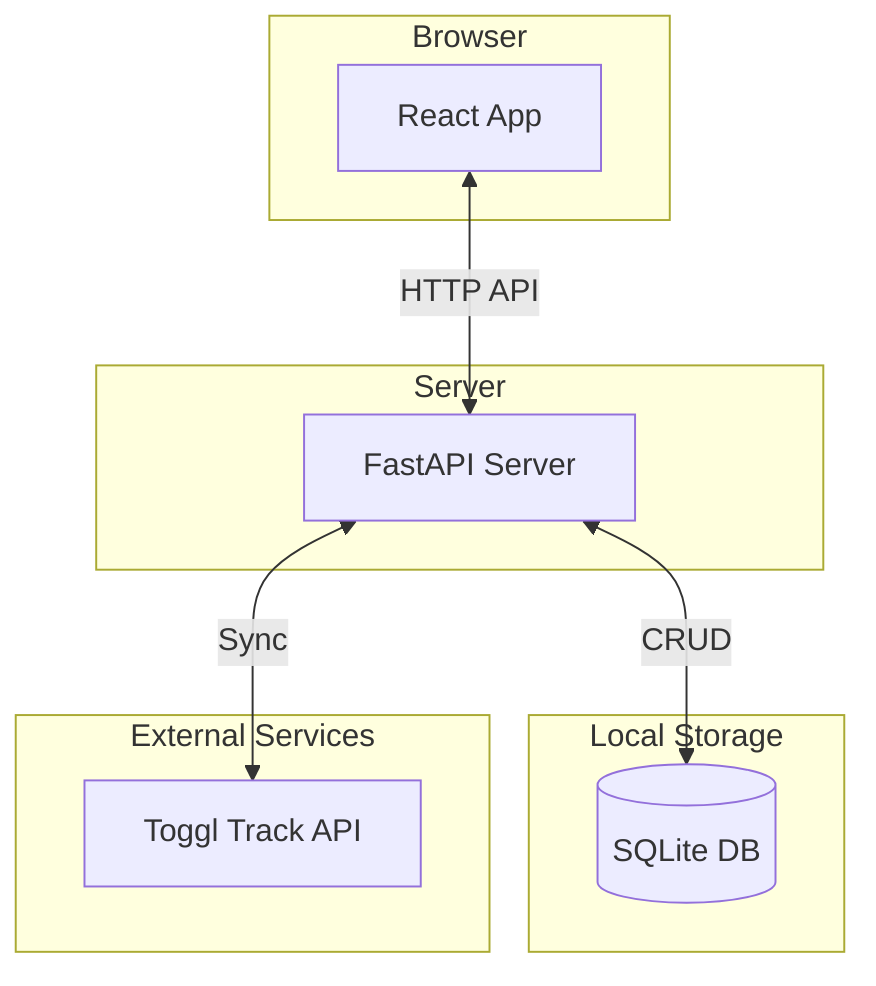

# Sync Toggl Track Events

This is a full-stack application for syncing [Toggl Track](https://toggl.com/track/) time entries to a local database. It provides a web interface to view, filter, and annotate your time entries with personal notes.

The main motivation is to have a private, enhanced view of your Toggl data, allowing for more detailed annotations than Toggl's native tags provide.

## Features

- **Backend**:
    - Built with [FastAPI](https://fastapi.tiangolo.com/).
    - Syncs Toggl time entries into a local [SQLite](https://www.sqlite.org/index.html) database.
    - Provides a REST API for the frontend to consume.

- **Frontend**:
    - Built with [React](https://reactjs.org/), [Vite](https://vitejs.dev/), and [TypeScript](https://www.typescriptlang.org/).
    - UI components from the [Mantine](https://mantine.dev/) library.
    - Uses [TanStack React Query](https://tanstack.com/query/latest) for data fetching, caching, and optimistic UI updates.
    - Daily view of time entries with navigation.
    - Add and delete notes on individual time entries.
    - Filter entries by project.
    - Displays the currently running Toggl timer with a live-updating duration.

## Architecture

The project is a classic client-server application.



## Setup and Running

### Prerequisites

-   [Python 3.12+](https://www.python.org/)
-   [`uv`](https://astral.sh/uv/) (Python package/dependency manager)

    The recommended way to install `uv` is via the official standalone installer script (not via pip):
    
    ```sh
    curl -LsSf https://astral.sh/uv/install.sh | sh
    ```
    
    For more details and alternative installation methods (including Windows), see the [official uv installation documentation](https://docs.astral.sh/uv/getting-started/installation/#installation-methods).

-   [Node.js and pnpm](https://pnpm.io/installation)

### 1. Backend Setup

The backend server is responsible for syncing data from Toggl and providing it to the frontend.

1.  **Navigate to the backend directory:**
    ```bash
    cd backend
    ```

2.  **Set up environment variables:**
    Create a `.env` file by copying the example:
    ```bash
    cp .env.example .env
    ```
    Now, edit `.env` and fill in your details:
    -   `TOGGL_TOKEN`: Your Toggl API token, found on your [profile page](https://track.toggl.com/profile).
    -   `WORKSPACE_ID`: Find this in the URL of your Toggl workspace (e.g., `https://track.toggl.com/reports/summary/<WORKSPACE_ID>`).

3.  **Install Python dependencies:**
    ```bash
    uv sync
    ```

4.  **Initialize the Database:**
    The database schema must be created before running the app. The easiest way is to run the first cell of the `full-sync.ipynb` notebook.
    - Open `backend/full-sync.ipynb` in a Jupyter environment (like VS Code's notebook editor).
    - Run the first cell to create the `time_entries` and `entry_notes` tables in `data/time_tracking.sqlite`.

5.  **Perform Initial Data Sync:**
    You can run the rest of the `full-sync.ipynb` notebook to populate your database with all your Toggl history. Alternatively, once the server is running, you can use the "Run Full Sync" button in the web UI.

6.  **Run the Backend Server:**
    ```bash
    uv run uvicorn main:app --host 0.0.0.0 --port 4545 --reload
    ```
    The API will be available at `http://localhost:4545`.

### 2. Frontend Setup

The frontend provides the web interface for interacting with your synced data.

1.  **Navigate to the frontend directory:**
    ```bash
    cd frontend
    ```

2.  **Install Node.js dependencies:**
    ```bash
    pnpm install
    ```

3.  **Run the Frontend Development Server:**
    ```bash
    pnpm dev
    ```
    The app will be available at `http://localhost:5173`.

    **Note:** The Vite dev server is configured to proxy API requests (`/api`) to the backend at `http://localhost:4545`. If you change the backend port, update `frontend/vite.config.ts` accordingly.

## API Endpoints

The backend exposes the following main endpoints:

-   `POST /sync/full`: Kicks off a full sync of all time entries from Toggl.
-   `POST /sync/recent`: Syncs the last 2 days of time entries.
-   `GET /sync/current`: Gets the currently running time entry from Toggl.
-   `GET /time_entries`: Fetches time entries for a given UTC datetime window.
-   `GET /projects`: Returns a list of all unique project names.
-   `POST /notes`: Adds a note to a time entry.
-   `DELETE /notes/{note_id}`: Deletes a note.

Check the backend code in `backend/main.py` for more details on the API.

## Deployment & Authentication

This guide details how to deploy the full-stack application to production using Fly.io for the backend, Netlify for the frontend, and Cloudflare for DNS and authentication.

The final architecture uses Cloudflare Zero Trust to protect both the frontend and backend. Users log in with a configured identity provider (e.g., Google) to access the frontend. The frontend communicates with the backend via a Netlify proxy, which securely injects a Cloudflare Service Token to authenticate its requests to the backend API.

### 1. Prerequisites

- A registered domain name managed by Cloudflare.
- Accounts for Fly.io, Netlify, and Cloudflare.
- `flyctl` CLI installed.

### 2. Backend Deployment on Fly.io

1.  **Launch the App on Fly.io:**
    Navigate to the `backend` directory and run the launch command. This will generate a `fly.toml` configuration file.
    ```bash
    cd backend
    flyctl launch --name your-app-name-api
    ```
    When prompted, do **not** set up a database. We will use a persistent volume for the SQLite file.

2.  **Configure a Persistent Volume:**
    The SQLite database needs to be stored on a persistent volume to survive deployments. Create a volume for your app (e.g., 1GB).
    ```bash
    flyctl volumes create data --size 1
    ```
    Your `fly.toml` should already contain the correct `[[mounts]]` section to use this volume.

3.  **Set Secrets:**
    The backend needs your Toggl credentials. Set them as secrets on Fly.io.
    ```bash
    flyctl secrets set TOGGL_TOKEN="YOUR_TOGGL_TOKEN" WORKSPACE_ID="YOUR_WORKSPACE_ID"
    ```

4.  **Deploy the Backend:**
    ```bash
    flyctl deploy
    ```
    After deployment, Fly.io will give you a hostname like `your-app-name-api.fly.dev`.

### 3. DNS Configuration on Cloudflare

1.  **Create a CNAME record for your backend API.** This must be set to **DNS Only** (grey cloud) to work with Fly.io's SSL certificate provisioning.
    - **Type:** `CNAME`
    - **Name:** `api.your-domain.com`
    - **Target:** `your-app-name-api.fly.dev`
    - **Proxy status:** DNS Only

2.  **Create a CNAME record for the Fly.io SSL certificate.** Fly.io requires this for domain validation.
    - **Type:** `CNAME`
    - **Name:** `_acme-challenge.api`
    - **Target:** `your-app-name-api.fly.dev`
    - **Proxy status:** DNS Only

3.  **Point your main frontend domain to Netlify.** The specifics will be provided by Netlify, but it's typically a CNAME record. This one should be **Proxied** (orange cloud) to benefit from Cloudflare's features.
    - **Type:** `CNAME`
    - **Name:** `your-app-name.your-domain.com`
    - **Target:** `your-app.netlify.app`
    - **Proxy status:** Proxied

### 4. Frontend Deployment on Netlify

1.  **Connect Your Git Repository:**
    In the Netlify dashboard, add a new site and connect it to the Git repository containing this project.

2.  **Configure Build Settings:**
    Netlify needs to know how to build the site from the `frontend` subdirectory. Ensure your settings are:
    - **Base directory:** `frontend`
    - **Build command:** `pnpm run build`
    - **Publish directory:** `dist`
    The `frontend/netlify.toml` file in this repository is already configured with these settings.

3.  **Add Environment Variables for the Service Token:**
    Later, we will generate a Cloudflare Service Token. Netlify needs to store its credentials. Go to **Site settings > Build & deploy > Environment** and add:
    - `ACCESS_CLIENT_ID`: The Client ID from the Cloudflare service token.
    - `ACCESS_CLIENT_SECRET`: The Client Secret from the Cloudflare service token.

4.  **Deploy:**
    Trigger a deployment on Netlify. It will build and deploy your frontend.

### 5. Authentication with Cloudflare Zero Trust

This is the final step to secure your application.

1.  **Create a Service Token:**
    - In the Cloudflare Zero Trust dashboard, go to **Access > Service Auth**.
    - Click **Create Service Token**.
    - Name it (e.g., `Netlify Proxy`), and click **Generate token**.
    - **Important:** Copy the `Client ID` and `Client Secret`. Add them to your Netlify environment variables as described in the previous section.

2.  **Create the Frontend Application:**
    - Go to **Access > Applications** and **Add an application** of type **Self-hosted**.
    - **Application name:** `Your App Name Frontend`
    - **Application domain:** `your-app-name.your-domain.com`
    - **Policies:** Create an `Allow` policy that requires authentication from your chosen provider (e.g., a rule for `Emails` matching your Google account).

3.  **Create the Backend Application:**
    - Add another **Self-hosted** application.
    - **Application name:** `Your App Name Backend`
    - **Application domain:** `api.your-domain.com`
    - **Policies:** Create two policies. The order does not matter.
        - **Policy 1: Allow Netlify**
            - **Action:** `Service Auth`
            - **Rule:** Create a rule where **Service Token** `is` the `Netlify Proxy` token you created.
        - **Policy 2: Allow Your Login** (for accessing `/docs` in the browser)
            - **Action:** `Allow`
            - **Rule:** Create a rule for `Emails` matching your personal email.
    - Save the application. You do not need to configure CORS settings for the backend app, as all requests come from the Netlify proxy.

Once these steps are complete, your application will be fully deployed and secured.

## Future Improvements

-   **User Authentication**: Secure the application with a login system.
-   **More Advanced Reporting**: Add charts and summaries for time spent on projects.
-   **Containerization**: Add `Dockerfile`s for easier deployment.
-   **Configuration UI**: Allow setting Toggl credentials from the UI instead of a `.env` file.
-   **Schema Migrations**: Use a tool like Alembic for managing database schema changes. 